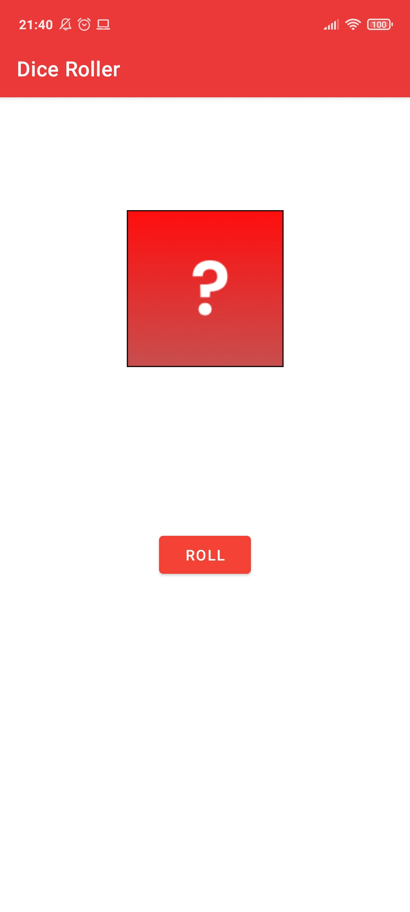
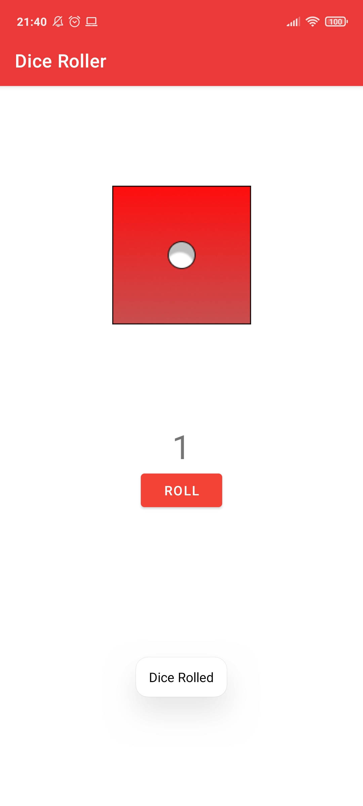
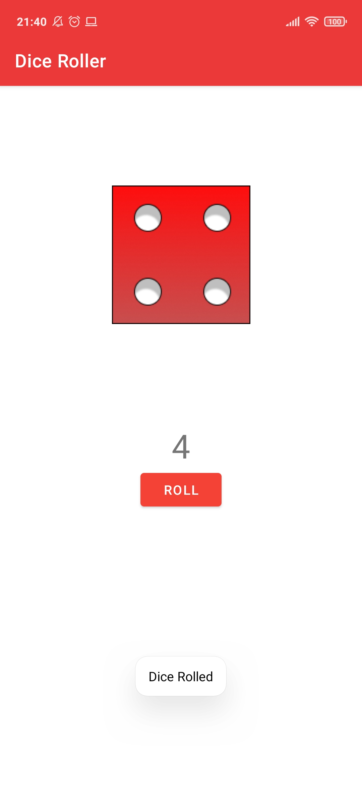

<h1 align="center"> Dice Roller </h1>

This project was build using kotlin. It is my first step with the language. The application does a simple random dice roll defined with six sides

<h3 style="color:grey">App:</h3>

    
    
    

